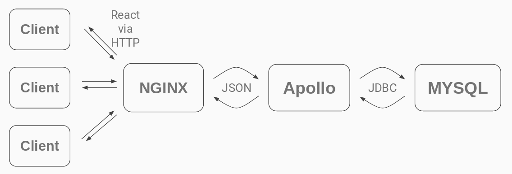

# Agora

This is an event sharing platform built for Cooper Union's ECE-366: Software Engineering. This website can be found and used [here](http://199.98.27.114:8000/).

### Team Members:
* Benjamin Kaplan
* Will Chen
* Rayhan Syed
* Guy Bar Yosef
* Josh Go

## Setup

### Block Diagram


### Frontend Setup

Our front end uses React to build the UI, and we use Yarn to manage our dependencies.

To start the app in development mode, first go to the folder */APPLICATION/FOLDER/agora*. First we need to install all the dependencies using the command:
```
yarn install
```
After installing the dependencies, we can start the app in development mode using the command:
```
yarn start
```
The app should start, and to access it simply go to *http://localhost:3000* if it doesn't automatically direct you there. Note that the app will send its backend requests to wherever is specified in the file *//APPLICATION/FOLDER/agora/src/BackendRoute.js*. We have our setup in such a way that we test the app using the localhost IP and the production IP is http://199.98.27.114, and so when we make sure to uncomment the one we to use at any point in time. 

### Backend Setup

Our back end consists of restful API services along with a database.

#### Services

We use [Spotify Apollo](https://github.com/spotify/apollo) to set up our API services.
We use maven to manage our dependencies and so all of our project's dependencies can be found at [/APPLICATION/FOLDER/Backend/apolloBackend/pom.xml](https://github.com/chenwill98/ECE-366-Agora/blob/master/Backend/apolloBackend/pom.xml).

To build our HTTP Server as a *jar* file simply call `mnv package`. The *jar* file will appear in *//APPLICATION/FOLDER/Backend/apolloBackend/target/apollo-backend.jar*.

The default port that our HTTP server is listening on is 8080 (If you change this or wish to have a backend listening on a different port, make sure to change the FrontEnd also in the *BackendRoute.js* file mentioned above). The port the backend is listening on can be changed in two ways. One is in the file [//APPLICATION/FOLDER/Backend/apolloBackend/src/main/resources/apolloBackend.conf](https://github.com/chenwill98/ECE-366-Agora/blob/master/Backend/apolloBackend/src/main/resources/apolloBackend.conf), changing the default port. The second way is to choose the port every time you run the server, adding the argument `HTTP_PORT=9000` into the maven command (in this case, the specified port is 9000).

To run a test in which one cleans up the previously generated *target* directory, execute the command `mvn clean package`.

Due to [CORS]{https://developer.mozilla.org/en-US/docs/Web/HTTP/CORS} (Cross-Origin Resource Sharing), we needed to specify in the backend which websites are allowed to interact with it, and because of our cookie implementation this requires use to specify the origin of the "Access-Control-Allow-Origin header directly, switching between *http://localhost:3000*, our frontend test port, and *http://199.98.114:8000*, our production port. We need to change which one of these we accept based on where our frontend is located. These need to be specified in the *jsonMiddleware()* function in the EventResource, GroupResource, and UserResource files in *//APPLICATION/FOLDER/Backend/apolloBackend/src/main/java/com/Resource* folder. 

#### MySQL Server

We use MySQL as our database. To run our database locally, after MySQL is installed one can create a database with the correct tables and fields using the command:
```
mysql database_name < /APPLICATION/FOLDER/Backend/MySQL/Database_Creation.SQL
```
where *database_name* will be the name of the created database and */APPLICATION/FOLDER/Backend/MySQL/Database_Creation.SQL* is the file containing the database schemas. Note that you may have to first create the database in MySQL beforehand (simply log into your mysql client and enter the command `create database database_name`) prior to importing the database's tables using our sql script.

Note that to run the database locally one needs to update the config file located at [/APPLICATION/FOLDER/Backend/apolloBackend/src/main/resources/apolloBackend.conf](https://github.com/chenwill98/ECE-366-Agora/blob/master/Backend/apolloBackend/src/main/resources/apolloBackend.conf) with your mysql username, password, and sql database location.

#### NginX

We use [NginX](https://www.nginx.com/) to serve our static files as well as to act as a proxy server to the Backend. Our application has NginX configured to listen on port 8000 and act as a reverse proxy to `localhost:8080` where the Backend server is set to listen. These configurations can be changed in the *nginx.conf* configuration file that is created during an NginX installation. This configuration file resides in different locations depending on OS- on debian based systems it can be found in */etc/nginx/nginx.conf*.

To run NginX locally, first install it (in a debian based system one could enter the command `sudo apt-get install nginx`). You could then configure NginX using the configuration file describe in the paragraph above. 

To run our application, first produce a */build* folder for the react app by entering the command `yarn run build` in the folder *//APPLICATION/FOLDER/agora*. 

Next, set up a server block in the NginX configuration file to look like:
```
server {
    listen 8000;
    server_name localhost;
    root /PATH/TO/BUILD/DIRECTORY/build;
    index index.html;
    location / {
        try_files $uri /index.html;
    }
}
```
specifying the build directory that you just created.

For more information on how to set up NginX, we recommend looking at the official [beginner's guide](http://nginx.org/en/docs/beginners_guide.html). A great (and brief) explanation on the specific configuration required for react apps can be found [here](https://stackoverflow.com/questions/43555282/react-js-application-showing-404-not-found-in-nginx-server).


#### Uploading our files to the VM

In this section we specify the steps that our group took uploading our application to the virtual machine.

1. SSH into the VM and install MySQL and NginX, configuring NginX as specified above.
2. Update the frontend *BackendRoute.js* file and the backend resource files to send and listen respectively to http://199.98.27.114 instead of localhost.
3. Run the *upload2vm.sh* script located in the */APPLICATION/FOLDER/*, entering in the ssh password when prompted. This file packages the front and backend, secure copies them to the VM into the *~/agora* folder, and concludes by ssh-ing you into the VM.
4. Check if the previous version of the backend is still running in the VM (using the command `ps -A | grep java`) and killing it if so.
5. Run the *run_backend.sh* script that resides in the *~/agora* folder. This script runs the backend using the VM's root MySQL user, logging all backend output to *log_output_apollo.txt*.

